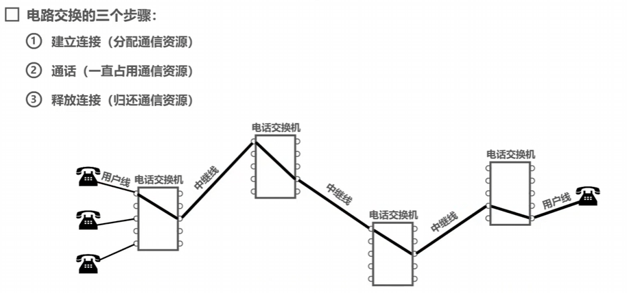
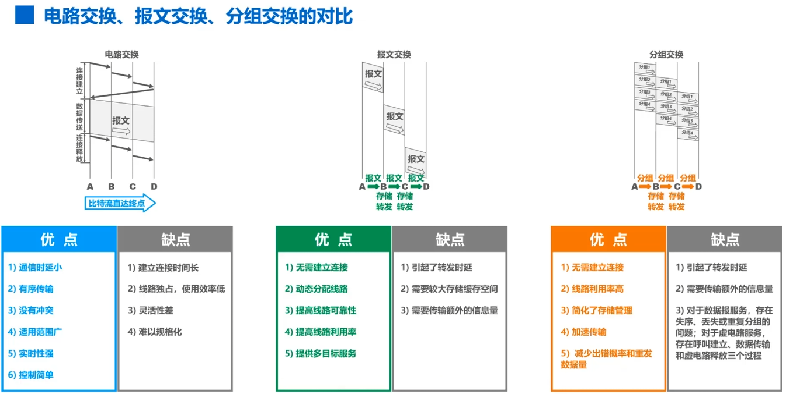
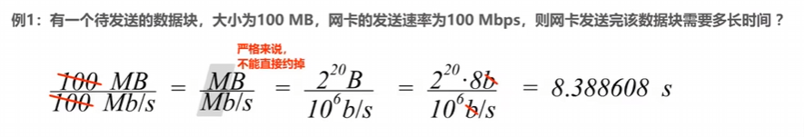
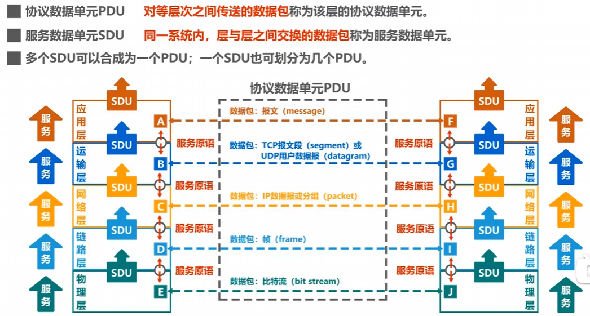
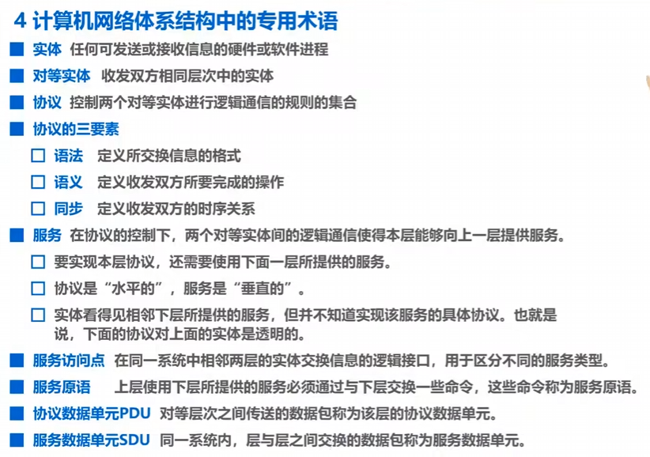
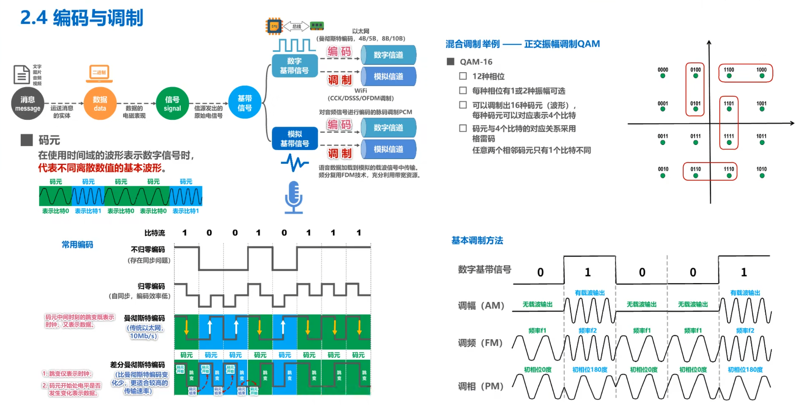

# 计算机网络

***

**计算机网络的定义:**
计算机网络主要是由一些通用的可编程的硬件互连而成的，
而这些硬件并非专门用来实现某一特定目的(例如，传送数据或视频信号)。
这些可编程的硬件能够用来传送多种不同类型的数据，并能支持广泛的和日益增长的应用。

#### 三种交换方式：电路交换、报文交换、分组交换。
电路交换：用电话交换机接通电话线的方式称为电路交换。

**计算机网络的分类:**

1. 按交换技术分类：电路交换网络、报文交换网络、分组交换网络； 
2. 按使用者分类：公用网、专用网； 
3. 按传输介质分类：有线网络、无线网络； 
4. 按覆盖范围分类：广域网WAN、城域网MAN、局域网LAN、个域网PAN； 
5. 按拓扑结构分类：总线型网络、星型网络、环形网络、网状型网络。

**计算机网络的性能指标:**

1. 速率：连接在计算机网络上的主机在数字信道上传送比特的速率。
    - 单位：bit/s=b/s=bps
2. 带宽：用来表示网络的通信线路所能传送数据的能力，因此网络带宽表示在单位时间内从网络中的某一点到另一点所能通过的最高数据率。
    - 单位：b/s、kb/s、Mb/s
3. 吞吐量：吞吐量表示在单位时间内通过某个网络(或信道、接口)的数据量。 
    - 吞吐量受网络的带宽或额定速率的限制。
4. 时延：
    - 发送时延 = 分组长度(b) / 发送速率(b/s)
    - 传播时延 = 信道长度(m) / 电磁波传播速率(m/s)
    - 处理时延：一般不便于计算，忽略不计。
5. 时延带宽积：传播时延 * 带宽
6. 往返时间RTT：通信双方交互一次所消耗的时间。
7. 利用率：
    - 信道利用率：用来表示某信道有百分之几的时间是被利用的(有数据通过)。
   （根据排队论，当某信道的利用率增大时，该信道引起的时延也会迅速增加，因此信道利用率并非越高越好。）
    - 网络利用率：全网络的信道利用率的加权求和。
8. 丢包率：即分组丢失率，是指在一定的时间范围内，传输过程中丢失的分组数量与总分组数量的比率。
    - 分组丢失的两个主要原因：分组误码，结点交换机缓存队列满(网络拥塞)。

**网络体系结构**

 - OSI体系结构：物理层、数据链路层、网络层、运输层、会话层、表示层、应用层。
 - TCP/IP体系结构：网络接口层、网际层、运输层、应用层。
 - 五层协议原理体系结构：物理层、数据链路层、网络层、运输层、应用层。

“分层“可将庞大而复杂的问题，转化为若干较小的局部问题，而这些较小的局部问题就比较易于研究和处理。

**OSI体系结构每一层的作用：**
1. 物理层：解决使用何种信号来传输比特的问题。
2. 数据链路层：解决分组在一个网络(或一段链路)上传输的问题。
3. 网络层：解决分组在多个网络上传输(路由)的问题。
4. 运输层：解决进程之间基于网络的通信问题。
5. 会话层：解决进程之间的会话问题。
6. 表示层：解决通信双方交换信息的表示问题。
7. 应用层：解决通过应用进程的交互来实现特定网络应用的问题。

### 物理层

物理层协议的主要任务：
 - 机械特性：指明接口所用接线器的形状和尺寸，引脚数目和排列、固定和锁定装置。
 - 电气特性：指明在接口电缆的各条线上出现的电压的范围。
 - 功能特性：指明某条线上出现的某一电平的电压表示何种意义。
 - 过程特性：指明对于不同功能的各种可能事件的出现顺序。

